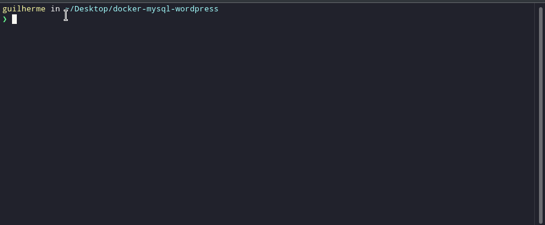
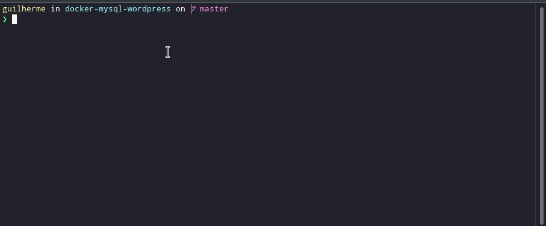

## 🚀 Clonando o ambiente

Clone o repositório para ter acesso ao código


```bash
$ git clone https://github.com/g-santosmartins/docker-mysql-wordpress.git

```

```bash
$ cd docker-mysql-wordpress
```

<h1 align="center">
    
</h1>

Rode:
```bash
$ docker-compose up -d
```

## 🧪 Subindo o ambiente de desenvolvimento


Apatir do comando apresentado cria o projeto que irá orquestrar todo o ambiente:

- [Wordpress na port 8020](http://localhost:8020/wp-admin/)
- [phpMyAdmin na porta 8183](http://localhost:8183/)
- [MySQL na porta 3306](http://localhost:3306)

## 🧪 Desligando os containers


<h1 align="center">
    
</h1>

## 🧪 Tecnologias utilizadas

O projeto foi desenvolvido usando as tecnologias:

- [Docker](https://www.docker.com/)
- [Wordpress](https://wordpress.com/pt-br/)
- [phpMyAdmin](https://www.phpmyadmin.net/)
- [MySQL](https://www.mysql.com/)


## 📝 Linceça

This project is licensed under the MIT License. See the [LICENSE](LICENSE.md) file for details.
---

<p align="center">Feito com muito ❤️ por Guilherme Martins</p>